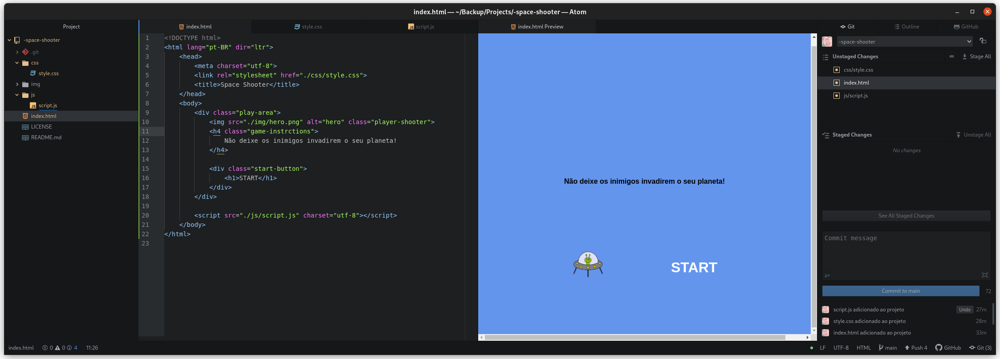

# Space Shooter

Joguinho de space shooter

Nste desafio criaremos um Space Shooter utilizando HTML, CSS e Javascript. Faremos uso de posicionamento do CSS e lógica de programação com posicionamento de CSS, manipulação do DOM, eventListeners, e manipulação de Array.

## Tecnologias usadas neste projeto
- HTML
- CSS
- JavaScript

## Editor de código
[Atom](https://atom.io/) - A hackable text editor for the 21st Century
